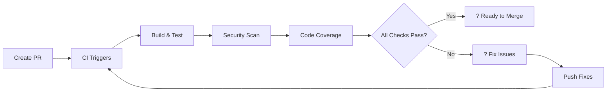

# AccountingSystem DevOps Usage Guide ??

This guide explains how to use the CI/CD pipeline, work with pull requests, and deploy the AccountingSystem application built with .NET 8 (LTS).

## Table of Contents
- [CI/CD Overview](#cicd-overview)
- [Running CI/CD Manually](#running-cicd-manually)
- [Pull Request Workflow](#pull-request-workflow)
- [Deployment Process](#deployment-process)
- [Example: Complete Feature Development Cycle](#example-complete-feature-development-cycle)
- [Troubleshooting](#troubleshooting)

## CI/CD Overview

Our DevOps pipeline consists of three main workflows:

### ?? **CI (Continuous Integration)**
- **Triggers**: Push/PR to `main` or `develop`
- **What it does**: 
  - Builds on Windows & Ubuntu
  - Runs tests with SQL Server
  - Generates code coverage
  - Security scanning
  - Caches NuGet packages

### ?? **CD (Continuous Deployment)**
- **Triggers**: Push to `main` or manual trigger
- **What it does**:
  - Builds Docker image
  - Deploys to Staging (automatic)
  - Deploys to Production (requires approval)

### ?? **Security**
- **CodeQL**: Weekly security scans
- **Dependabot**: Automatic dependency updates

## Running CI/CD Manually

### 1. Trigger CI Manually
CI automatically runs on pushes and PRs, but you can also:

```bash
# Push to trigger CI
git push origin your-branch-name

# Or create a PR to trigger CI
gh pr create --title "Your PR Title" --body "Description"
```

### 2. Trigger CD Manually

Go to GitHub Actions ? `.NET CD` ? `Run workflow`:


**Options:**
- **Environment**: Choose `staging` or `production`
- **Branch**: Usually `main`

### 3. Monitor Progress

1. Go to **Actions** tab in your repository
2. Click on the running workflow
3. Watch real-time logs and progress

## Pull Request Workflow

### How PR Checks Work

When you create a PR, the following happens automatically:



### PR Status Checks

- ? **Build (Ubuntu)**: Code compiles successfully
- ? **Build (Windows)**: Cross-platform compatibility
- ? **Tests**: All unit/integration tests pass
- ? **CodeQL**: No security vulnerabilities
- ? **Coverage**: Code coverage report generated

### PR Requirements

Before merging, ensure:
- [ ] All status checks are green ?
- [ ] At least 1 reviewer approval (for `develop`)
- [ ] At least 2 reviewer approvals (for `main`)
- [ ] Branch is up-to-date with target branch
- [ ] All conversations are resolved

## Deployment Process

### Staging Deployment (Automatic)
Every push to `main` automatically deploys to staging:

```bash
main branch ??push??> CI/CD ??> Build ??> Deploy to Staging
```

**Staging URL**: `https://accounting-staging.yourdomain.com`

### Production Deployment (Manual Approval)
Production requires manual approval:

```bash
Staging Success ??> Production Job ??> ?? Approval Required ??> Deploy to Production
```

**To approve production deployment:**
1. Go to **Actions** ? Running workflow
2. Click **Review deployments**
3. Select **production** environment
4. Click **Approve and deploy**

**Production URL**: `https://accounting.yourdomain.com`

## Example: Complete Feature Development Cycle

Let's walk through creating a new feature from start to finish:

### Step 1: Create Feature Branch
```bash
# Start from develop branch
git checkout develop
git pull origin develop

# Create feature branch
git checkout -b feature/add-invoice-management
```

### Step 2: Develop Your Feature
```bash
# Make your code changes
# Add files, modify existing code...

# Test locally (.NET 8)
dotnet build
dotnet test
dotnet run --project src/Accounting.Api
```

### Step 3: Commit and Push
```bash
# Commit your changes
git add .
git commit -m "feat: add invoice management functionality

- Add Invoice entity and repository
- Implement CRUD operations
- Add validation rules
- Include unit tests

Closes #123"

# Push to GitHub
git push -u origin feature/add-invoice-management
```

### Step 4: Create Pull Request
```bash
# Using GitHub CLI
gh pr create \
  --title "feat: Add invoice management functionality" \
  --body "This PR implements invoice management with CRUD operations, validation, and tests." \
  --base develop \
  --assignee @HeshamAbdallah02
```

**What happens next:**
1. ?? CI workflow starts automatically
2. ?? Tests run on Windows & Ubuntu
3. ?? CodeQL security scan runs
4. ?? Code coverage report generated
5. ?? PR template fills out automatically

### Step 5: Monitor CI Results
Go to your PR page and watch the checks:

```
? CI / build-and-test (ubuntu-latest)
? CI / build-and-test (windows-latest)  
? CodeQL Security Scan
?? Coverage report (uploading...)
```

### Step 6: Code Review
1. Request review from team members
2. Address feedback if any
3. Push additional commits if needed
4. Ensure all checks pass

### Step 7: Merge to Develop
```bash
# After approval, merge via GitHub UI or CLI
gh pr merge --squash --delete-branch
```

### Step 8: Deploy to Staging
```bash
# Create PR from develop to main
git checkout develop
git pull origin develop
git checkout main
git pull origin main
git checkout -b release/v1.2.0

# Create release PR
gh pr create \
  --title "release: v1.2.0" \
  --body "Release v1.2.0 with invoice management feature" \
  --base main
```

### Step 9: Production Release
1. Merge release PR to `main`
2. ?? CD workflow starts automatically
3. ? Staging deployment happens first
4. ?? Production deployment waits for approval
5. ?? Approve production deployment manually
6. ?? Feature is live!

### Step 10: Create Release Tag
```bash
# Tag the release
git checkout main
git pull origin main
git tag -a v1.2.0 -m "Release v1.2.0: Add invoice management"
git push origin v1.2.0
```

## Troubleshooting

### Common Issues and Solutions

#### ? Build Fails
**Problem**: `dotnet build` fails in CI
**Solution**:
```bash
# Check locally first (.NET 8)
dotnet clean
dotnet restore
dotnet build

# Check for missing dependencies
dotnet list package --outdated
```

#### ? Tests Fail
**Problem**: Tests pass locally but fail in CI
**Solution**:
```bash
# Run tests with same conditions as CI
dotnet test --configuration Release --verbosity detailed

# Check for environment-specific issues
# - Database connection strings
# - File paths (Windows vs Linux)
# - Time zones
```

#### ? Docker Build Fails
**Problem**: Docker image build fails
**Solution**:
```bash
# Test Docker build locally (.NET 8)
docker build -t accounting-api -f src/Accounting.Api/Dockerfile .

# Check Dockerfile paths and dependencies
# Ensure all required files are copied
```

#### ? Deployment Approval Timeout
**Problem**: Production deployment times out waiting for approval
**Solution**:
1. Go to **Actions** tab
2. Find the workflow run
3. Click **Review deployments**
4. Approve within 30 days (default timeout)

#### ?? Cache Issues
**Problem**: Build is slow due to cache misses
**Solution**:
```bash
# Clear GitHub Actions cache if needed
gh cache list
gh cache delete <cache-key>
```

### Getting Help

1. **Check workflow logs**: Actions tab ? Select workflow ? View logs
2. **Review PR checks**: PR page ? Details links for each check
3. **Local debugging**: Reproduce issues locally first
4. **Documentation**: Check this guide and GitHub docs

## Useful Commands

### GitHub CLI Commands
```bash
# View workflow runs
gh run list

# View specific workflow run
gh run view <run-id>

# Re-run failed workflow
gh run rerun <run-id>

# List PRs
gh pr list

# Check PR status
gh pr status
```

### Docker Commands
```bash
# Pull latest image (.NET 8)
docker pull ghcr.io/heshamabdallah02/accountingsystem/accounting-api:latest

# Run locally
docker run -p 8080:8080 ghcr.io/heshamabdallah02/accountingsystem/accounting-api:latest

# Check image history
docker history ghcr.io/heshamabdallah02/accountingsystem/accounting-api:latest
```

---

## ?? Quick Reference

| Action | Command |
|--------|---------|
| Create feature branch | `git checkout -b feature/my-feature` |
| Run tests locally | `dotnet test` |
| Create PR | `gh pr create` |
| Trigger deployment | GitHub Actions ? Run workflow |
| Check workflow status | `gh run list` |
| Approve production | Actions ? Review deployments |

**Remember**: Always test locally with .NET 8 before pushing, and ensure all CI checks pass before merging to `main`! ??